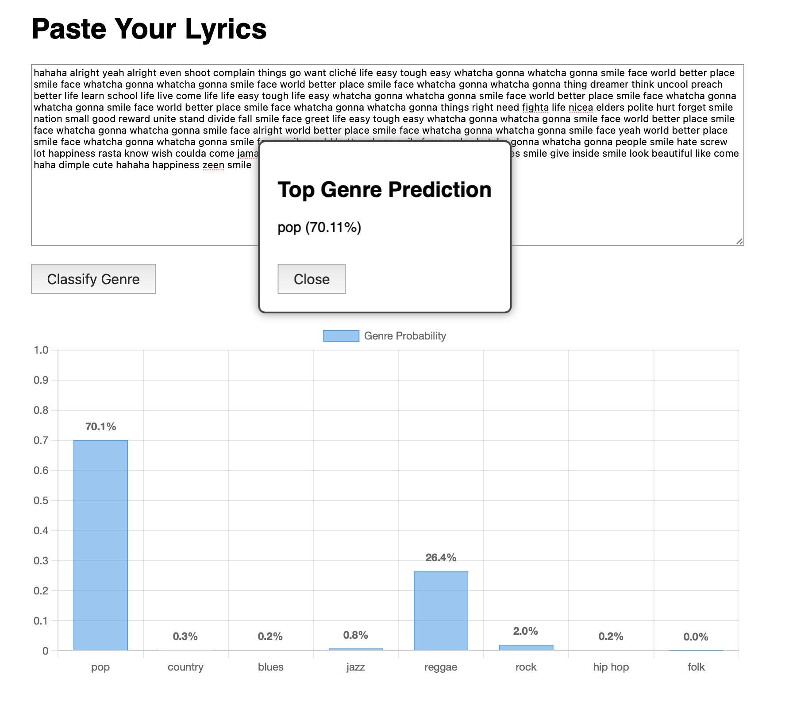

# Mendeley Genre Classifier

A Java-based web application that classifies song lyrics into 7 music genres using an Apache Spark ML pipeline. Main The app provides an interactive web UI to paste lyrics, trigger classification, and visualize prediction probabilities via bar chart.




## 🎯 Features

* Paste lyrics and classify them into one of 8 genres: **Pop, Country, Blues, Jazz, Reggae, Rock, Hip Hop, Folk**
* Built using **Apache Spark**, **Jetty**, **Gradle**, and **Chart.js**
* Visualization of genre probabilities using a responsive bar chart
* Modal dialog shows the top predicted genre with confidence

---

## 🎥 Demonstration
<video width="850" height="550" controls>
  <source src="assets/demonstration.mp4" type="video/mp4">
</video>

## 🚀 Running the App

### Prerequisites

* Java 17+ installed
* Spark environment variables (classpath) already configured (i.e., you can run `spark-shell`)

### Steps

1. Clone or download the repository
2. Open a terminal and run:

   ```
   ./run.sh
   ```

   This will:

   * Build the fat JAR using Gradle and Shadow plugin
   * Launch the Jetty server on `http://localhost:8080`
   * Open the default browser

---

## 📂 Project Structure

```
├── build.gradle
├── run.bat
├── src
│   ├── main
│   │   ├── java
│   │   │   └── org.mendeley
│   │   │       ├── WebApp.java              # Jetty server
│   │   │       ├── Main.java                # Spark training/testing entry
│   │   │       └── controller
│   │   │           └── PredictHandler.java  # POST endpoint /predict
│   │   └── resources
│   │       └── public
│   │           └── index.html               # Web UI
```

---

## 🔧 How It Works

* `Main.java` loads the Spark model and starts the server. Initially need to run `./gradlew build` and `./gradlew run` to run the NLP pipeline and save the model. Then you can use `./run.sh` to run the server.
* `PredictHandler.java` handles POST requests to `/predict` endpoint
* `WebApp.java` starts a Jetty server
* `/predict` endpoint accepts POST requests with lyrics
* Spark `PipelineModel` transforms the lyrics and returns genre probabilities
* `index.html` visualizes results with a bar chart (Chart.js)
* Highest scored genre is shown in a styled popup modal

---

## 📦 Building the JAR (manually)

If needed, you can manually build the JAR with:

```bash
./gradlew clean shadowJar
```

The output fat JAR will be at:

```
build/libs/mendeley-web-all.jar
```

---

## ✅ Example Input

Paste lyrics like:

```
I'm a rolling thunder, a pouring rain
I'm comin' on like a hurricane
My lightning's flashing across the sky
You're only young but you're gonna die
```

Then click **Classify Genre**.

---

## 📋 License

MIT License
